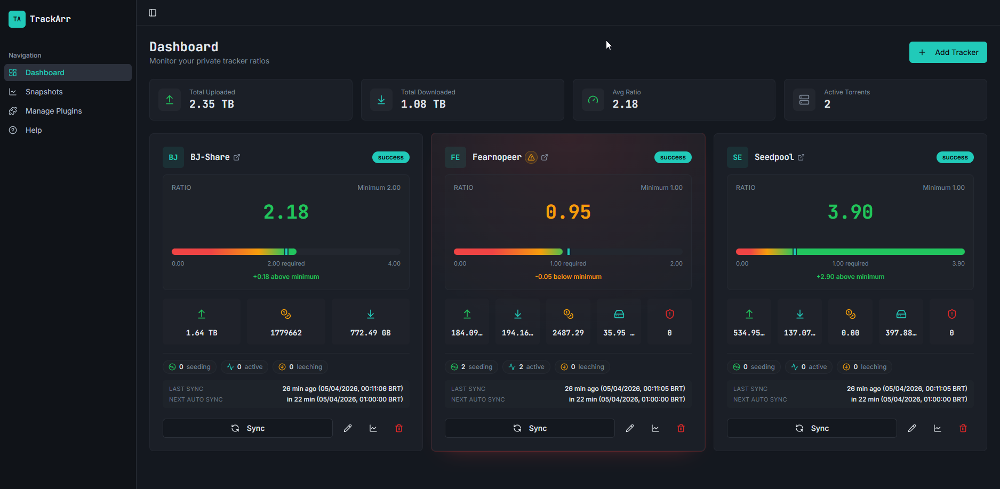
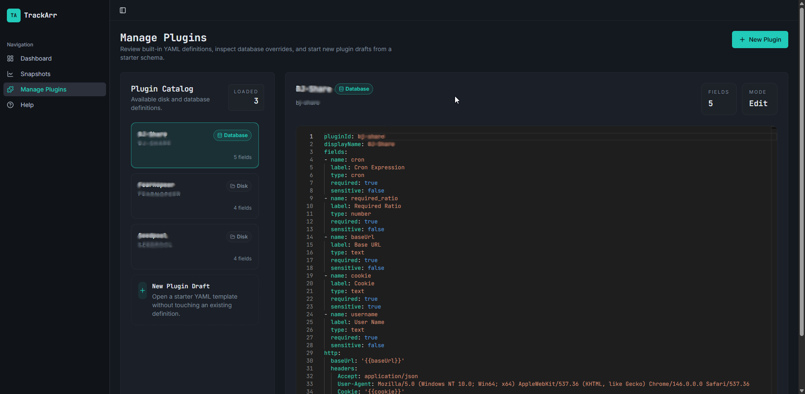

# TrackArr

| Status | Badge |
| --- | --- |
| CI pipeline | [](https://github.com/leandrobattochio/trackarr/actions/workflows/ci.yml) |
| Cypress E2E | [](https://github.com/leandrobattochio/trackarr/actions/workflows/full-stack-e2e.yml) |
| Frontend coverage (`frontend/`) | [](https://app.codecov.io/github/leandrobattochio/trackarr?flags%5B0%5D=frontend) |
| Backend coverage (`backend/`) | [](https://app.codecov.io/github/leandrobattochio/trackarr?flags%5B0%5D=backend) |

TrackArr is a self-hosted dashboard for private tracker monitoring. It lets you register tracker integrations, sync stats manually or on a schedule, keep historical snapshots, and define new tracker connectors through YAML instead of hard-coded backend logic.

## Docker Compose example

For self-hosting on your own server, the stack needs the TrackArr container plus a PostgreSQL database. A minimal `docker-compose.yml` can look like this:

```yaml
services:
  db:
    image: postgres:17-alpine
    container_name: trackarr-db
    restart: unless-stopped
    environment:
      POSTGRES_DB: trackarr
      POSTGRES_USER: arr
      POSTGRES_PASSWORD: arr123
    volumes:
      - /mnt/user/appdata/trackarr/postgres:/var/lib/postgresql/data
    healthcheck:
      test: ["CMD-SHELL", "pg_isready -U arr -d trackarr"]
      interval: 10s
      timeout: 5s
      retries: 5
    networks:
      - arr

  trackarr:
    image: ghcr.io/leandrobattochio/trackarr:v0.2.2
    container_name: trackarr
    depends_on:
      db:
        condition: service_healthy
    restart: unless-stopped
    ports:
      - "3012:3000"
    environment:
      ASPNETCORE_ENVIRONMENT: Production
      ConnectionStrings__PostgresConnection: Host=db;Port=5432;Database=trackarr;Username=arr;Password=arr123
      Hangfire__Directory: /data
      Plugins__Directory: /data
      Updates__CheckForUpdates: "true"
      APP_TIMEZONE: America/Sao_Paulo
      TZ: America/Sao_Paulo
    volumes:
      - /mnt/user/media/backup_configuracoes/trackarr:/data
    networks:
      - arr

networks:
  arr:
    driver: bridge
```

Adjust the host volume paths, published port, timezone, and image tag to fit your environment.

TrackArr can check GitHub Releases for newer container tags. `Updates__CheckForUpdates` controls the default for automatic update checks, and it defaults to `true` when omitted. After this setting is changed from the Settings page, the database value overrides the environment variable until it is changed again in the UI.

## What it does

- Monitors tracker ratio and transfer stats from a single dashboard
- Stores historical snapshots for time-based charts
- Runs recurring sync jobs per integration using cron expressions
- Supports built-in and custom tracker plugins
- Lets you inspect, create, and edit disk-backed plugin definitions from the UI
- Includes a settings area for HTTP defaults and runtime information
- Ships as a single production container with the React frontend served by ASP.NET Core

## Core features

- Dashboard with per-tracker cards for ratio, uploaded, downloaded, seed bonus, buffer, hit and runs, and torrent counts
- Manual sync for any configured integration
- Automatic recurring sync with Hangfire-backed scheduling
- Snapshot charts for uploaded/downloaded bytes and torrent activity
- In-app YAML editor for plugin authoring with schema-aware validation, completions, snippets, and hover docs
- Settings page for the shared `User-Agent` header and system information

## Screenshots

### Dashboard

The dashboard is the main operational view. It combines portfolio-level totals across all configured trackers with per-integration cards that surface ratio status, key metrics, last sync state, next automatic run, and quick actions for syncing, editing, opening snapshots, or deleting an integration.

The screenshot below also shows the ratio-warning treatment in context: integrations that fall below the configured minimum ratio are visually highlighted so risky trackers stand out immediately.



### Manage Plugins

The plugin-management screen is where plugin definitions are inspected, created, and edited. The catalog on the left shows the YAML files currently available, while the editor on the right exposes the definition that drives integration forms, HTTP steps, mappings, and dashboard metrics.

Saves are blocked when the document is malformed or semantically invalid, and the editor includes TrackArr-specific validation and authoring help while you work.



## Architecture

### Frontend

- React 19
- Vite 7
- TypeScript
- TanStack Query
- Tailwind CSS + Radix UI + Monaco editor + Monaco YAML services

The frontend runs on `http://localhost:8080` in development and proxies `/api` requests to the backend on `http://localhost:5000`.

### Backend

- ASP.NET Core Web API on `.NET 10`
- Entity Framework Core with PostgreSQL
- Hangfire + `Hangfire.Storage.SQLite`
- Scalar/OpenAPI in development
- YAML plugin engine powered by `YamlDotNet`

The production container serves the API and the built frontend together on port `3000`.

## Project structure

```text
.
|-- backend/
|   |-- TrackerStats.sln
|   |-- plugins/                    # Built-in YAML tracker definitions
|   `-- src/
|       |-- TrackerStats.Api/       # API, DI, startup, controllers
|       |-- TrackerStats.Application/
|       |-- TrackerStats.Domain/    # Entities, repository interfaces, plugin contracts
|       `-- TrackerStats.Infrastructure/
|           |-- Data/               # EF Core DbContext and migrations
|           |-- Plugins/            # Plugin registry, YAML engine, loaders
|           `-- Services/           # Sync jobs and scheduling
|-- frontend/
|   |-- src/
|   |   |-- app/                    # App bootstrap and routing
|   |   |-- features/               # Integrations, plugins, help, snapshots
|   |   |-- layouts/
|   |   `-- shared/
|   `-- package.json
`-- docker/
    |-- Dockerfile
    `-- docker-compose.yml
```

## How plugins work

TrackArr uses YAML plugin definitions to describe how to connect to a tracker:

- `fields`: form inputs required to configure an integration
- `customFields`: optional tracker-specific inputs beyond the shared integration fields
- `http`: shared base URL and headers
- `steps`: HTTP requests and extraction rules
- `mapping`: how extracted values map into TrackArr stats
- `dashboard`: which stats should be shown on the UI card, including optional `byteUnitSystem` for binary vs decimal byte formatting

The frontend plugin editor validates more than generic YAML syntax. It understands the TrackArr plugin structure, shows completions for supported fields and enums, offers snippets for common blocks, and blocks saves when the document is malformed or semantically invalid.

Built-in plugins currently included:

- `asc`
- `bj-share`
- `fearnopeer`
- `seedpool`

Plugin definitions are loaded from YAML files on disk. The Manage Plugins page edits those files directly.

## Local development

### Requirements

- Node.js 22+
- Yarn
- .NET SDK 10

### Local development config

`appsettings.Development.json` is intentionally untracked. If you want local development defaults, create `backend/src/TrackerStats.Api/appsettings.Development.json` on your machine.

Example:

```json
{
  "Plugins": {
    "Directory": "../../plugins"
  },
  "ConnectionStrings": {
    "PostgresConnection": "Host=127.0.0.1;Port=5432;Database=trackarr;Username=trackarr;Password=trackarr"
  }
}
```

Notes:

- Keep this file local only. Do not commit machine-specific or secret values.
- Use environment variables instead when you want settings that also work in CI or Docker.
- Set `Plugins:Directory` to your local plugin YAML folder. In this repo, `../../plugins` resolves to `backend/plugins`.
- `ConnectionStrings:PostgresConnection` is required for the main application database.

### 1. Run the backend

```powershell
cd backend
dotnet restore TrackerStats.sln
dotnet run --project src\TrackerStats.Api\TrackerStats.Api.csproj
```

Development defaults:

- API: `http://localhost:5000`
- OpenAPI + Scalar UI: `http://localhost:5000/scalar/v1`
- Hangfire dashboard: `http://localhost:5000/hangfire`

On startup the backend:

- applies EF Core migrations automatically to the configured PostgreSQL database
- creates the default application settings row if it does not exist
- schedules recurring jobs for saved integrations

### 2. Run the frontend

```powershell
cd frontend
yarn install
yarn dev
```

Frontend dev server:

- App: `http://localhost:8080`
- API proxy: `/api` -> `http://localhost:5000`

## Docker deployment

The Docker setup builds the frontend, publishes the backend, starts the API container, and runs PostgreSQL alongside it.

```powershell
cd docker
docker compose up --build
```

Default runtime values:

- App URL: `http://localhost:3000`
- Persistent data volume: `trackarr_data`
- Internal data directory: `/data`
- Default timezone: `America/Sao_Paulo`

Relevant environment variables from `docker/docker-compose.yml`:

- `ConnectionStrings__PostgresConnection`
- `APP_TIMEZONE`
- `Hangfire__Directory`
- `Plugins__Directory`
- `Updates__CheckForUpdates`
- `POSTGRES_DB`
- `POSTGRES_USER`
- `POSTGRES_PASSWORD`
- `POSTGRES_PORT`

Storage layout:

- PostgreSQL stores the main application data
- Hangfire stores job data in a SQLite file under `Hangfire__Directory`
- Plugin definitions are read from `Plugins__Directory`
- Update checks query GitHub Releases when `Updates__CheckForUpdates` is enabled, unless the Settings page has stored an override

## Data storage

By default TrackArr stores:

- application data in PostgreSQL
- Hangfire job state in a separate SQLite database
- plugin YAML files on disk

In Docker, Hangfire files live under `/data` and plugin definitions default to `/data/templates`, so both persist with the mounted volume.

## API overview

Main endpoints:

- `GET /api/integrations`
- `POST /api/integrations`
- `PUT /api/integrations/{id}`
- `DELETE /api/integrations/{id}`
- `POST /api/integrations/{id}/sync`
- `GET /api/integrations/{id}/snapshots`
- `GET /api/snapshots?integrationId=...`
- `GET /api/plugins`
- `GET /api/plugins/{pluginId}`
- `POST /api/plugins`
- `PUT /api/plugins/{pluginId}`
- `GET /api/settings`
- `PUT /api/settings`
- `GET /api/about`

Plugin create/update requests use raw YAML in the request body.

## UI pages

- `/` dashboard for integrations and sync status
- `/snapshots` chart view for historical metrics
- `/plugins` YAML plugin management with schema-backed IntelliSense and save-blocking validation
- `/settings` shared HTTP settings and system information
- `/help` usage guidance
